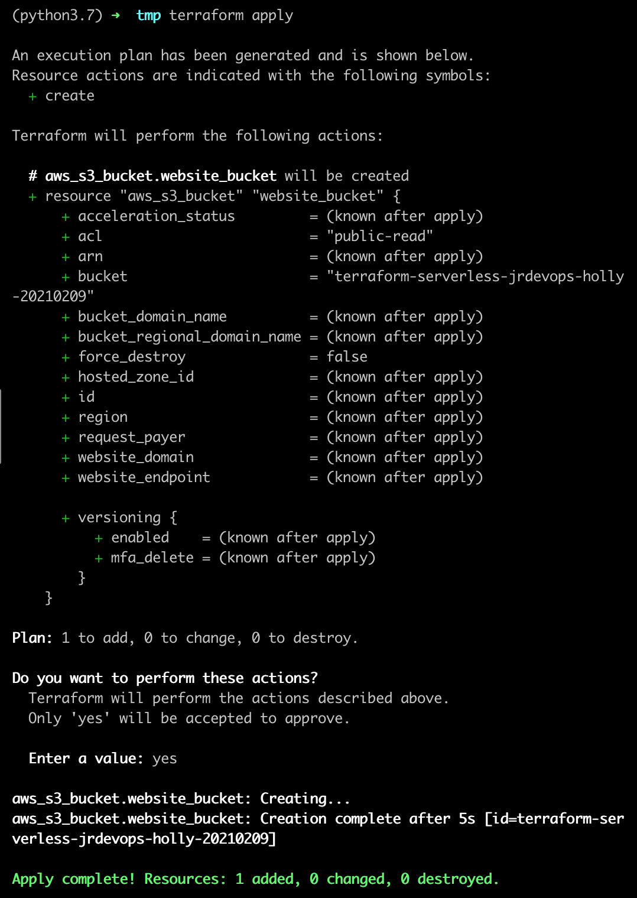

# Homework

## Question 1
In the first handon [1 - s3_lamda_gateway_api.md](1%20-%20s3_lamda_gateway_api.md), you may notice that we manually create
S3 and copy file over it.
Can you write a terraform code block that creates the S3 bucket?

Tip: Refer to https://www.terraform.io/docs/providers/aws/r/s3_bucket.html and https://www.terraform.io/docs/providers/aws/r/s3_bucket_object.html

## Question 2
Go through our terraform code base, what other attributes can you parametrise into variables.tf file?

Which of these variables should live in the `hands_on/variables.tf` file and which should live in the `hands_on/staging/services/backend_app/variables.tf` file?

Why?

## Question 3
How do you determine the changes between two different deployments in the past?

## Question 4
IaC code is also code. Think about programming best practices. How can you test your terraform code?

# Answer
## Question 1
1. Create an empty folder in your preferred path
2. Create a file named `s3.tf`, you can refer to above documentation to write your own terraform code.
```
> Example s3.tf
resource "aws_s3_bucket" "website_bucket" {
  bucket = "terraform-serverless-jrdevops-holly-20210209"
  acl    = "public-read"
}
```
3. Create a file named `main.tf`, you can use the content of your existing `main.tf` in our handson.
```
> Example main.tf
provider "aws" {
  region                  = "ap-southeast-2"
  shared_credentials_file = "/Users/holly/.aws/credentials"
  profile                 = "default"
}
```
4. run `terraform init` in this folder
5. run `terraform apply` in this folder
6. You will see below output as success message.

7. Resume the following steps in [handson_1](1 - s3_lamda_gateway_api.md) to copy the zip file to S3, and create `lambda.tf`
8. Make sure to use the name of your new bucket in your terraform code e.g. `lambda.tf`
